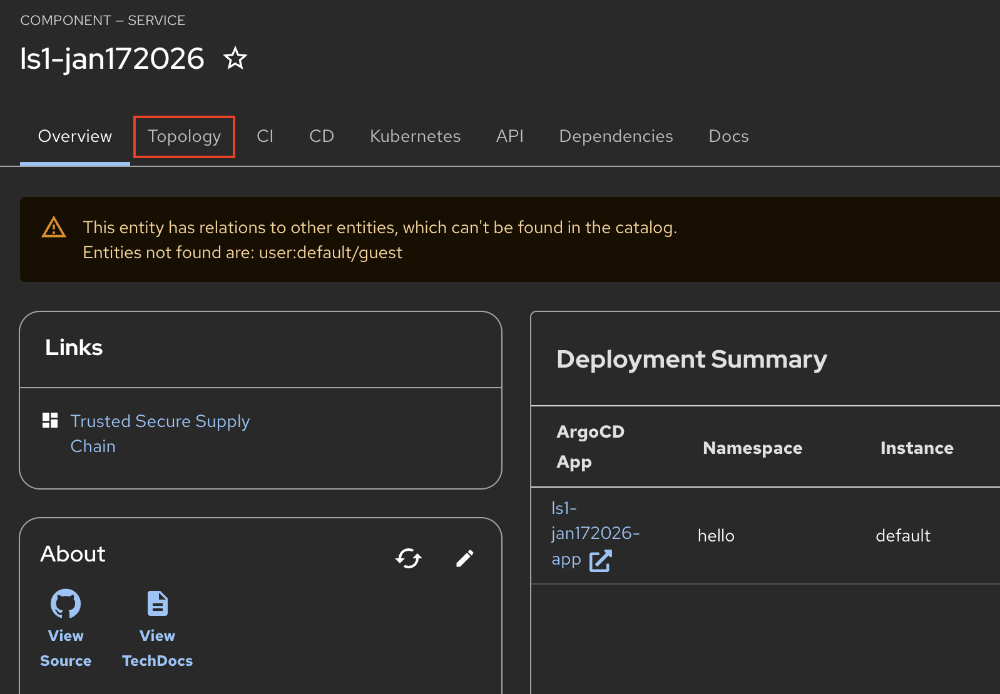
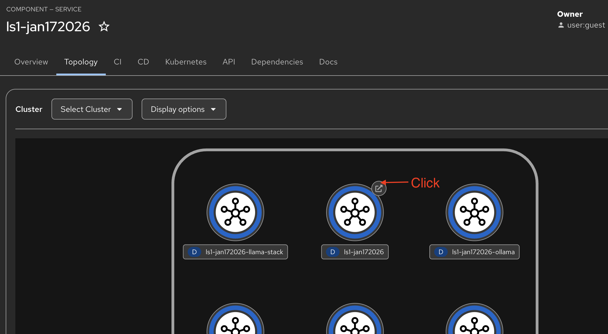

# **Introduction**

Congratulations! You deployed a **Llama Stack Agentic AI Workflow** application from a Software Template. The template has created a new source code repository for the application code, as well as a new GitOps deployment repository to handle deployment related tasks.

!!! info

    **Source Code Repository:** [https://github.com/redhat-appstudio-mjf/maysun-ls-5](https://github.com/redhat-appstudio-mjf/maysun-ls-5)

    **GitOps Repository:** [https://github.com/redhat-appstudio-mjf/maysun-ls-5-gitops](https://github.com/redhat-appstudio-mjf/maysun-ls-5-gitops)

# **What This Application Does**

The Llama Stack Agentic application is an intelligent chat interface that:

1. **Classifies User Questions** - Dynamically routes queries to specialized AI Agents
2. **Multi-Agent Orchestration** - Employs specialized agents for:
   - **Legal** - License and compliance questions
   - **HR** - Human resources queries
   - **Sales** - Business development questions
   - **Procurement** - Vendor and supply chain queries
   - **Tech Support** - OpenShift/Kubernetes troubleshooting with cluster integration
3. **RAG-Powered Responses** - Uses vector stores for accurate, context-aware answers
4. **Content Safety** - Implements guardrails using Llama Guard
5. **OpenShift/Kubernetes Integration** - Tech Support agent uses MCP tools to list pods and monitor resource consumption
6. **GitHub Issue Tracking** - Tech Support agent creates GitHub issues with RAG sources and classification details for follow-up

# **Usage**

To access the maysun-ls-5 application that was deployed using the Software Template, complete the following instructions:

!!! tip

    All of this information can be found as part of your deployed **Component** in the Red Hat Developer Hub (RHDH) UI!

You can view the Topology of deployed resources by navigating to the **Topology** tab:

From that view, to navigate straight to your sample application, you can click the arrow on the Deployment resource of the application.

!!! info

    If you are met with a placeholder web page your application may still be building and has not yet been deployed! You can verify this by checking the **CI** tab to see if all related pipeline tasks have completed.

# **Architecture Components**

This template deploys four interconnected services:

| Component | Port | Description |
|-----------|------|-------------|
| **Streamlit UI** | 8501 | Interactive chat interface |
| **Llama Stack Server** | 8321 | AI inference orchestration |
| **Ollama** | 11434 | Local LLM inference engine |
| **Kubernetes MCP Server** | 8080 | Cluster introspection tools |

# **Environment Variables**

The application uses the following configuration:

| Variable | Description | User Input |
|----------|-------------|------------|
| `INFERENCE_MODEL` | Model for classification: `vllm/redhataiqwen3-8b-fp8-dynamic` | Software Template Form |
| `GUARDRAIL_MODEL` | Content safety model: `` | Software Template Form |
| `MCP_TOOL_MODEL` | Model for tool calls: `vllm/redhataiqwen3-8b-fp8-dynamic` | Software Template Form |
| `OPENAI_API_KEY` | Required for text embeddings | Software Template Form |
| `GITHUB_TOKEN` | GitHub integration | OpenShift/Kubernetes Secret |
| `GITHUB_URL` | Target repository for GitHub MCP Tool | Software Template Form |

The Llama Stack server uses the following configuration:

| Variable | Description | User Input |
|----------|-------------|------------|
| `VLLM_URL` | URL for vLLM inference server | Software Template Form |
| `VLLM_API_KEY` | API key for vLLM server | OpenShift/Kubernetes Secret |
| `OPENAI_API_KEY` | API key for OpenAI models | OpenShift/Kubernetes Secret |

# **Source Code**

The application source code structure:

| File | Description |
|------|-------------|
| `streamlit_app.py` | Main Streamlit application entry point |
| `src/workflow.py` | LangGraph workflow definitions |
| `src/responses.py` | RAG service and response generation |
| `src/ingest.py` | Document ingestion pipeline |
| `src/methods.py` | Agent method implementations |
| `src/models.py` | Pydantic models for structured output |
| `config/ingestion-config.yaml` | Vector database pipeline configuration |
| `Containerfile` | Container image build instructions |

# **Deployment Information**

If you are interested in seeing the deployed OpenShift/Kubernetes resources, all resources were deployed into your chosen project/namespace of hello2. You can access this project/namespace through the web console (if available) or via your CLI.

!!! tip

    You can also login to your ArgoCD server to see the Argo view for deployed resources, such as your application itself!

